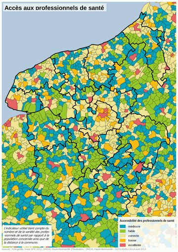

title: Dotation en professionnels de santé
created: 20131113
modified: 20131113
author: scomte

La [Base Permanente des Equipements][BPE] de l'INSEE fourni des données sur le nombre de médecins généralistes, spécialistes et d'auxiliaires de santé pour chaque commune du territoire. Pour une lecture rapide du territoire, cette donnée brute présente deux inconvénients :
* elle est très détaillée pour chaque corps de métiers
* elle traduit mal l'accessibilité réelle de la population au service médical de proximité. On peut habiter une commune ne disposant d'aucun médecin et être voisin d'une autre qui dispose d'un cabinet médical bien pourvu.

Il a donc été décidé de produire un indicateur de synthèse qui agrège la donnée brute à la fois sur le plan de la fonction et sur le plan de la proximité.

## Principe de construction

### Présence des professionnels de santé

La première étape consiste à créer artificiellement la notion d'équivalent médecin (Mc) qui est une moyenne pondérée
* du nombre d'auxiliaires de santé (`Ac`, coef 1),
* du nombre de médecins généralistes (`Gc`, coef 2)
* du nombre de médecins spécialistes (`Sc`, coef 3)

```
Mc = 0,5 x (Ac + 2xGc + 3xSc)
```

La deuxième étape consiste à pondérer cette offre de service par la population susceptible de l'utiliser et créer la notion de Disponibilité (`Dc`) qui dépend de la population présente sur la commune `c` et les territoires voisins (voir schéma ci-après)
* `Hc=Hc(0)` correspond à la population de la commune,
* `Hc(1)` correspond à la somme des populations des communes situées à moins de 1,5 kilomètres du centre de la commune (proximité immédiate coef 1/2),
* `Hc(2)` correspond à la somme des populations des communes y situées entre 1,5 et 3 kilomètres du centre de la commune (proche coef 1/4),
* `Hc(3)` correspond à la somme des populations des communes z situées entre 3 et 6 kilomètres du centre de la commune (accessible coef 1/8).

```
Dc = Mc / (Hc+Hc(1)/2+Hc(2)/4+Hc(3)/8) = 29-01-01
```
<a href="dps/29-01-01-carte-PresenceProfSante-HN-201210.png"></img></a>

### Accessibilité des professionnels de santé

 La dernière étape consiste à faire une moyenne (`Ac`) des disponibilités en professionnels de santé d'une commune et de celles des territoires voisins pondérés en fonction de leur distance. Ainsi,
* `Dc(0)=Dc` correspond à la définition de l'indicateur constitué à la deuxième étape (coef 1),
* `Dc(1)` correspond à la moyenne des Dx(0) des communes x situées à moins de 1,5 kilomètres du centre de la commune (proximité immédiate coef 1/2),
* `Dc(2)` correspond à la moyenne des Dy(0) des communes y situées entre 1,5 et 3 kilomètres du centre de la commune (proche coef 1/4),
* `Dc(3)` correspond à la moyenne des Dz(0) des communes z situées entre 3 et 6 kilomètres du centre de la commune (accessible coef 1/8).

<a href="29-illustrationmethode-201210.png"></img></a>

```
Ac = Dc(0) + Dc(1)/2 + Dc(2)/4 + Dc(3)/8 = 29-01-02
```

Cette méthode a le mérite de "lisser" les valeurs de Mc et Dc sur le territoire en tenant compte des proximités d'offre de service.
Utilisation et limites

<a href="dps/29-01-02-carte-accesprofsante-hn-201304.png"></img></a>

## Valeurs de référence

Un des intérêts des variables `29-01-01` et `29-01-02` est qu'elles prennent des valeurs qui s'intègrent dans les références habituelles d'analyse sur ce thème. L'indicateur le plus traditionnel étant le nombre de médecins pour 1000 habitants, utilisé aussi bien par la DATAR dans le cadre de son observatoire des territoires que par l'OMS pour ses comparaisons internationales.

Pour information, la moyenne des pays de l'OCDE est de 3, celle de la France (en 2009) de 2,9 (avec des disparités importantes : la valeur pour les quartiers _populaires_ est de 0,59).

## Analyse des "grands" territoires

<a href="dps/29-01-02-graphe-classes_accessibilite_sante_communes-201210.png"></img></a>

Les indicateurs `A (29-01-02)` et `D (29-01-01)` ne peuvent pas être agrégé au niveau des territoires supérieurs (cantons, SCoT,...) en raison du multiple compte qu'il feraient alors d'une grande partie des professionnels de santé. Pour ces échelles, il sera plutôt recommandé soit d'examiner l'indicateur `M` qui peut s’agréger à toutes les échelles et constitue une bonne valeur de référence, soit de classer les communes et d'examiner la composition du territoire en nombre de communes ou en population pour chaque classe (cf. ci-contre).

[BPE]:../bases/BPE
