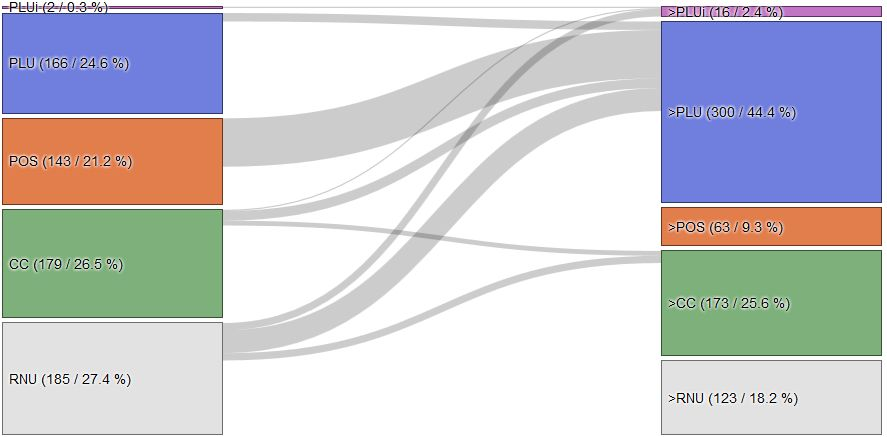
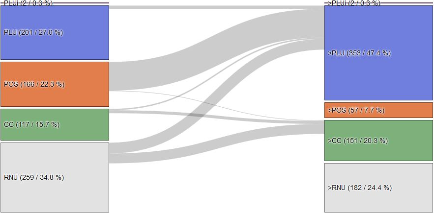
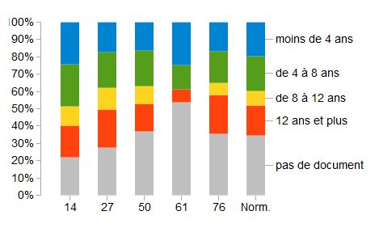

title: Documents d'urbanisme en Normandie
d3: urbanisme

## Analyse des données

Couverture et évolution en cours à partir des données de Sudocuh. [La dernière carte à jour](https://www.observatoire-des-territoires.gouv.fr/outils/cartographie-interactive/#bbox=-299869,6499646,606319,436810&c=indicator&i=planif_urbaine.etat_plu_pos_cc&view=map3) est disponible sur le site de l'observatoire des territoires.

### Normandie

<figure>
<table class="chrono3">
  <tr><td>Situation actuelle</td><td id="nbNorm"></td><td>à l'issue des procédures engagées</td></tr>
</table>

  <noscript></img></noscript>		

</figure>

En Normandie, au début de l'année 2015 plus d'un tiers du territoire n'était encore couvert par aucun document d'urbanisme. Il restait par ailleurs près d'un cinquième de commune couvertes par un Plan d'Occupation des Sols (POS). Les Plans Locaux d'Urbanisme (PLU) intercommunaux restaient largement minoritaires, concernant un vingtième des communes seulement.

La situation évolue toutefois rapidement. Plus de mille procédures d'élaboration ou de révision sont actuellement en cours représentant près d'une commune sur trois engagée dans une démarche. D'une part, la caducité annoncées des POS a conduit un grand nombre de communes, près de 360 soit près des deux tiers des communes concernées à transformer leur POS en PLU ou plus marginalement en PLUi. Par ailleurs, tirée notamment par certains territoires très dynamiques en matière de PLUi comme [la Manche](#manche) ou [le Calvados](#calvados), la part des communes sous Règlement National d'Urbanisme est en passe de diminuer de moitié.

A l'issue des procédures en cours, le paysage de l'urbanisme communal aura sensiblement évolué. A peine plus du cinquième des communes seront sous RNU. Auquelles il conviendra d'ajouter les communes dotées d'un POS en voie de caducité. Et si la part des communes disposant d'une Carte Communale sera restée stable, les communes disposant d'un PLU représenteront plus du tiers et celle couverte d'un PLUi près du cinquième.

### Calvados

<figure>
<table class="chrono3">
  <tr><td>actuelle</td><td id="nb14"></td><td>à l'issue proc.</td></tr>
</table>

  <noscript></img></noscript>

</figure>

Le territoire du Calvados se distingue par une part plus importante de commune couverte par un PLUi ou un PLU (près de la moitié des communes) et une part plus faible des communes sans aucun document (à peine plus d'un cinquième). Bien que les documents soient plutôt récents, la dynamique de transformation est sensiblement identique à la dynamique normande (un tiers des communes actuellement en procédure), mais est fortement impactée par cette structure : les élaborations ou extension de PLUi y sont plus nombreuses que sur le territoire normand dans son ensemble.

A terme, seul un dixième des communes seront sous RNU, et près du tiers seront engagées dans une démarche de planification intercommunale.

### Eure

<figure>
<table class="chrono3">
  <tr><td>actuelle</td><td id="nb27"></td><td>à l'issue proc.</td></tr>
</table>

  <noscript></img></noscript>

</figure>

Dans l'Eure, les communes se répartissent à peu près équitablement entre RNU, CC, POS et PLU. Avec un peu plus du quart des communes engagées dans une procédure, la dynamique y est plutôt moins marquée que sur l'ensemble de la Normandie et est essentiellement portée par la transformation de POS en PLU, la couverture des territoires sous RNU. La dynamique d'élaboration des PLUi reste assez marginale, même si les intentions manifestées lors de l'appel à projet PLUi, qui n'apparaissent pas dans ces statistiques, les procédures n'étant pas engagées, laissent présager une évolution plus positive.

A noter que dans le paysage à terme la part des POS, menacés de caducité, reste élevée. En revanche, les Cartes Communales ayant connu un vif succès, la part du territoire sous RNU devrait être inférieure au cinquième.

### Orne

<figure>
<table class="chrono3">
  <tr><td>actuelle</td><td id="nb61"></td><td>à l'issue proc.</td></tr>
</table>

  <noscript></img></noscript>

</figure>

Le territoire se caractérise à la fois par une très faible couverture initiale en documents d'urbanisme, à peine plus de deux cinquièmes et par une très importante dynamique en matière de PLUi. Ainsi plus d'une commune sur deux est actuellement engagée dans une procédure d'élaboration ou de révision, et près de neuf dixième de ces communes le sont dans une procédure de PLUi.

La transformation attendue est ainsi très radicale, puisqu'à terme, près de la moitié des communes sera dotée d'un PLUi et seul un quart restera soumise au RNU. A noter également que cette caractéristique conduira à une faible représentation des PLU et dans une moindre mesure des cartes communales.

### Seine-Maritime

<figure>
<table class="chrono3">
  <tr><td>actuelle</td><td id="nb76"></td><td>à l'issue proc.</td></tr></table>

  <noscript></img></noscript>

</figure>

Du fait du caractère très urbain de la vallée de Seine, la Seine-Maritime dispose d'une couverture importante en POS puis en PLU. Malgré cela, plus du tiers des communes restaient concernées par le RNU début 2015. En revanche les PLUi restaient absent du paysage, y compris dans la dynamique d'élaboration. Ainsi, celle-ci reste mesurée, moins d'un tiers des communes actuellement en procédure, et est actuellement portée par la transformation des POS en PLU et dans une moindre mesure par l'élaboration de documents sur les territoires en RNU, moitié PLU, moitié Cartes Communales.

Ainsi à terme, près de la moitié des communes seront dotées d'un PLU, un cinquième disposeront d'une carte communale et un quart resteront concernées par le RNU. Toutefois, un certain nombre de PLUi sont annoncés qui modifieront substantiellement la donne, avec en particulier le PLUi de la métropole de Rouen.

### Age des Documents

  <noscript></img></noscript>

Sur la Normandie dans son ensemble, un cinquième des communes dispose de documents d'urbanisme de moins de 4 ans, et un autre cinquième de documents de moins de 8 ans. La part des communes ayant des documents qui devraient être révisés assez rapidement dépasse le quart dont une bonne partie de document vraiment anciens.

Les départements pour lesquels la part des documents âgés de plus de 12 ans est la plus importante sont la Seine-Maritime (23% des communes) l'Eure (22%) et le Calvados (18%).

Mais le Calvados est également un territoire sur lequel près de la moitié des communes dispose de documents assez récents ou très récents. Seule l'Orne, dont la dynamique de planification est très récente présente une proportion de communes avec documents très récents supérieure (25%).

## Perspectives

Compte-tenu de ces éléments, de l'achèvement récent ou prochain d'un grand nombre de SCoT -  avec lesquels les documents devront se mettre en conformité, de la caducité annoncée des POS et de l'émergence progressive des PLUi, il est vraisemblable que l'activité en matière d'élaboration des documents d'urbanisme locaux restera soutenue au cours des années à venir.

La principale évolution devrait sans doute consister en une amélioration de la prise en compte des caractéristiques intercommunales des projets de territoires.
